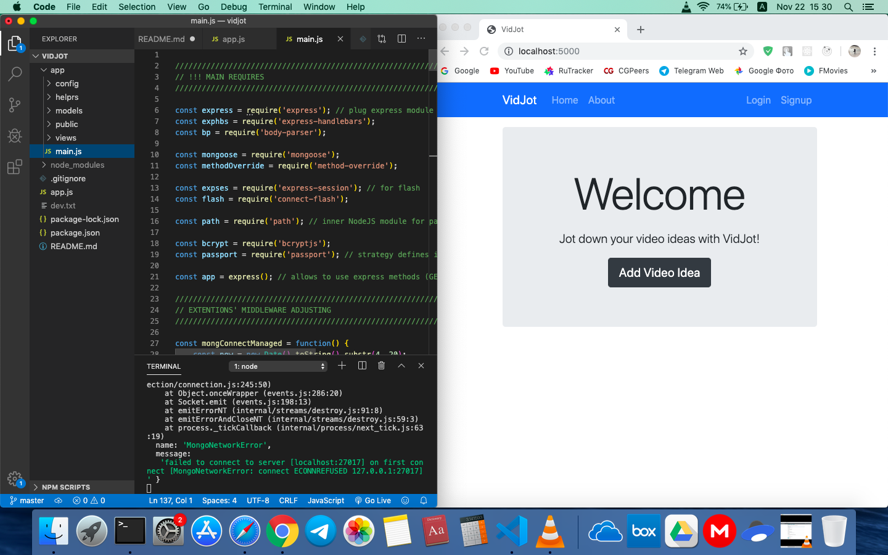

<h1>NodeJS-Sharepostt</h1>

<h2>User Guide</h2>

Application for storing notes for your future ideas.
App implements separate user registration and remotly storing data.

<h2>Dev Info</h2>

NodeJS list application. 
Routing emplemented by Express.
Page render constructed with Handlebars.
Data storege organised with MongoDB.
Remote deployment built on Heroku using mLab.

<h2>Repo Link</h2>

https://sharepostt.herokuapp.com/

<!-- 

<h2>App Screenshot</h2> -->

<!--  -->
